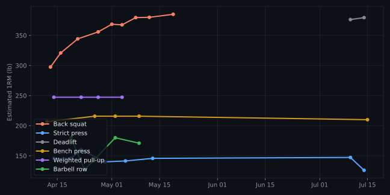
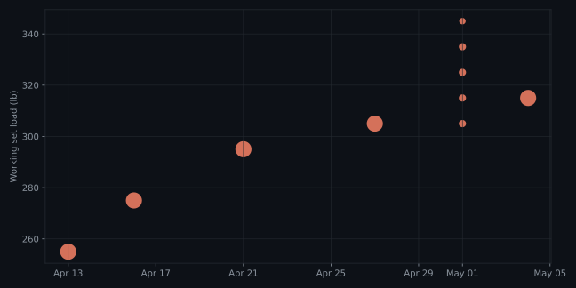
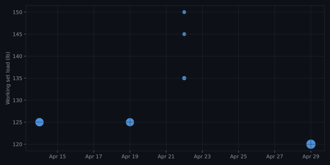
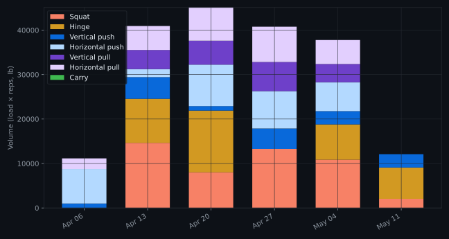

# Strength dashboard

_Updated May 13, 2026 6:23 PM · BW 180#_

## Featured lifts

| Lift | Current e1RM | Top set | Date | Δ vs prior |
|---|---:|---|---|---:|
| **Back squat** | 380# | 380# × 1 | May 12 | +0.5# vs May 8 |
| **Strict press** | 146# | 125# × 5 | May 13 | +4.3# vs May 5 |
| **Bench press** | 216# | 185# × 5 | May 9 | 0.0# vs May 2 |
| **Weighted pull-up** | 251# | BW+35# × 5 (sys 215#) | May 4 | 0.0# vs Apr 27 |
| **Barbell row** | 171# | 135# × 8 | May 9 | -9.0# vs May 2 |

## Estimated 1RM trend — all featured lifts

_Epley estimate from each session's top set. Sets above 10 reps excluded._

## Back squat — daily volume by load

_One dot per (date, load). Dot size scales with total reps that day at that load._

## Strict press — daily volume by load

_One dot per (date, load). Dot size scales with total reps that day at that load. Cycle priority lift._

## Weekly volume by movement pattern

_Stacked: total load × reps per pattern, week starting Monday._

## Recent PRs (last 8 weeks)

| Lift | Top set | e1RM | Date |
|---|---|---:|---|
| Back squat | 380# × 1 | 380.0# | May 12 |
| Weighted pull-up | BW+35# × 5 (sys 215#) | 250.8# | May 4 |
| Bench press | 185# × 5 | 215.8# | May 9 |
| Barbell row | 135# × 10 | 180.0# | Apr 19 |
| Strict press | 150# × 2 | 160.0# | Apr 22 |

---

## How this is generated

Two view modes, both fully static:

- **GitHub** — this `README.md`, rendered above. Regenerate with
  `python3 dashboard/render_md.py` (writes the .md plus SVG charts under
  `charts/`). Requires `matplotlib`.
- **Local browser** — open `dashboard/index.html` directly. Regenerate
  with `python3 dashboard/parse.py` (writes `data.js`).

### Adding a new lift to the dashboard

1. Add the lift name (lowercased) to `lift_aliases` in `config.json`,
   mapping to a canonical id.
2. Add the canonical id to `lift_display_names`.
3. To chart it on the e1RM line, add the id to `featured_lifts`.
4. To include it in volume rollups, add the id to one of the
   `pattern_buckets` lists.

### Format

Logs follow `workout/FORMAT.md`. The parser is permissive but the
working-set line (`<load> × <reps>` or `<load> × <reps>, ...`) must be
present for a movement to contribute to charts.
